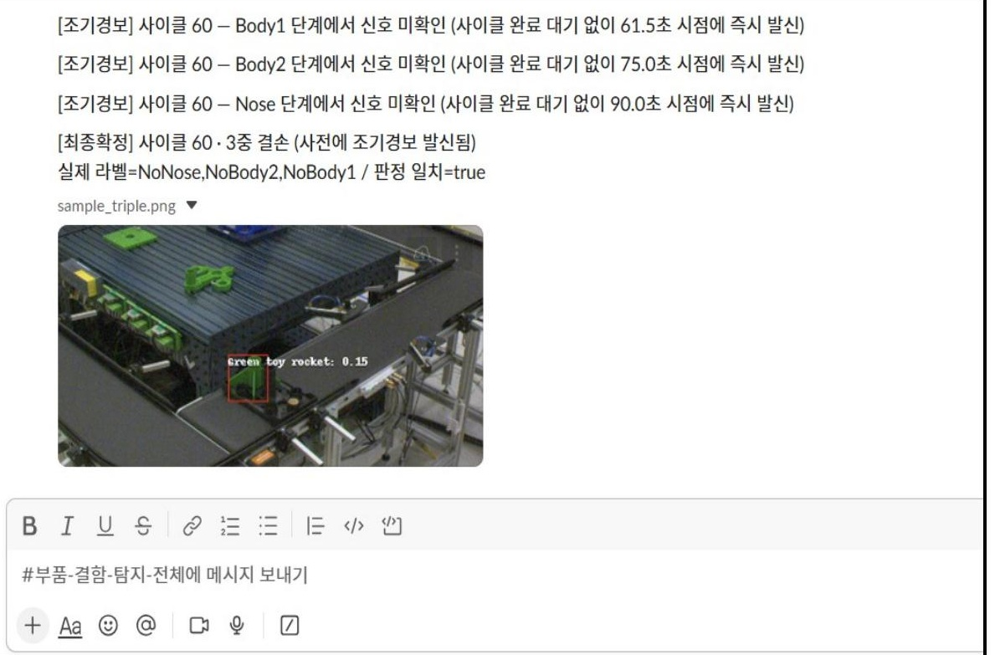
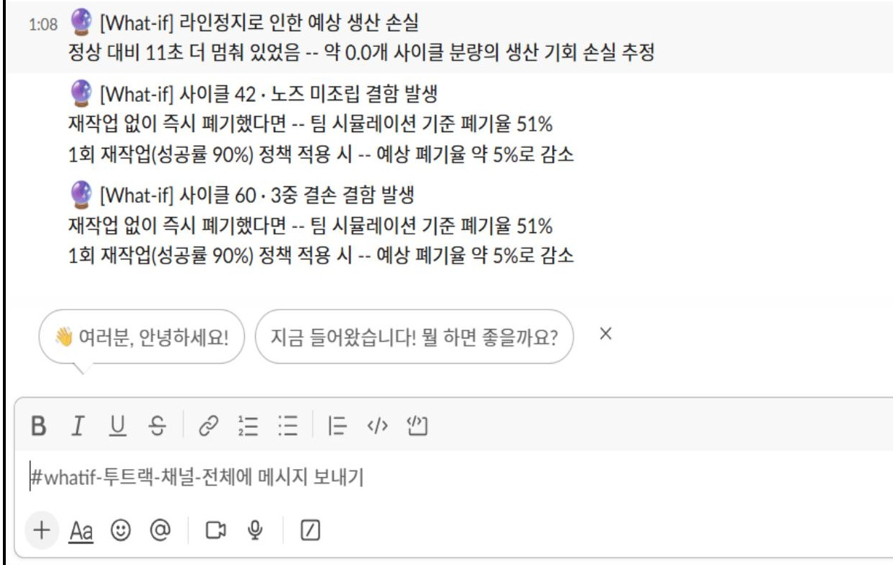

# AssemblyGuard

**로봇 조립라인 다중 센서 기반 결함 탐지 시스템**

정확도 0.978이라는 숫자를 그대로 믿지 않고, 검증 방식을 바꿔가며 원인을 끝까지 추적한 결과 — 학습 없이도 새로운 세션에 안정적으로 통하는 규칙기반 판정 방식을 완성한 프로젝트입니다.

🔗 **대시보드**: [ffcell-dashboard-4egcqkjsqrxjg8eytf63vq.streamlit.app](https://ffcell-dashboard-4egcqkjsqrxjg8eytf63vq.streamlit.app)
👥 **팀**: 분석의 민족 (5인) · 2026.06 – 2026.08 (3개월) · 튜터 임영재

---

## 왜 이 프로젝트가 흥미로운가

로봇 4대가 부품을 조립·분해하는 라인에서 부품 누락 결함을 조기 탐지하는 모델을 만들었습니다.
StratifiedKFold로 검증하면 정확도 0.978 — 좋아 보이는 숫자였지만, 실제 배포 환경은
"처음 보는 세션"을 판정해야 한다는 점이 걸렸습니다. 세션을 완전히 분리하는 GroupKFold로
다시 검증하자 정확도는 **0.240**으로 폭락했습니다.

여기서 멈추지 않고 원인을 추적했습니다. 의심 가는 센서 신호(R04)를 전부 제거해도 정확도는
여전히 0%에 머물렀고, 결국 진짜 원인은 **학습 데이터(세션1~4)에 일부 결함 클래스가 아예
존재하지 않는 구조적 문제**였습니다 — 어떤 모델도 배운 적 없는 클래스는 예측할 수 없습니다.

ML로는 원천적으로 풀 수 없는 문제였기에, 물리적으로 설명 가능한 **규칙기반 계층 분류기**로
방향을 전환했습니다. R03 조립력 파형의 4개 봉우리가 각 부품의 조립 동작에 대응한다는 점을
이용해 "봉우리 존재 여부" 체크리스트를 설계했고, 타이밍 밀림을 3단계로 보정해 세션 일반화
정확도를 **0.982**까지 끌어올렸습니다.

## 최종 결과

| 지표 | 값 | 조건 |
|---|---|---|
| 세션 일반화 정확도 | **0.982** | 2023년 데이터, GroupKFold, 규칙기반 단독 |
| Macro Recall | **0.979** | 위와 동일 조건 |
| 2024년 신규 데이터 일반화 | **90.3%** | n=93, 2023년 확정 임계값 재계산 없이 적용 |
| 3중결손 감지 시점 단축 | **106초 → 58초 (약 45%)** | n8n → Slack 조기경보 자동화 |

## 폴더 구조

```
AssemblyGuard/
├── README.md
├── notebooks/
│   ├── highlights_leakage_story.ipynb   ← 먼저 이걸 보세요. 핵심 스토리 발췌본
│   └── full_research_log/               ← 전체 분석 과정 원본 (568개 셀, v54~v81)
│       ├── 01_전처리_EDA_피처엔지니어링.ipynb
│       ├── 02_모델링_베이스라인_누수진단.ipynb
│       ├── 03_규칙기반분류기_개발.ipynb
│       ├── 04_타이밍보정_2024검증.ipynb
│       └── 05_알림자동화_n8n.ipynb
├── dashboard/
│   ├── app.py                           ← Streamlit 대시보드
│   └── data/                            ← 대시보드가 참조하는 집계·요약 데이터
└── images/
    ├── slack_alert_early_warning.jpg
    └── slack_alert_whatif.jpg
```

**`highlights_leakage_story.ipynb`를 먼저 열어보시길 권합니다.** 전체 연구 로그에서
핵심 디버깅 스토리(StratifiedKFold vs GroupKFold → R04 오염 발견 → 세션 편중 확정 →
규칙기반 돌파구 → 0.982 달성 → 2024 검증)만 뽑아 재구성한 발췌본이며, 모든 셀은
원본 노트북에서 그대로 가져온 실제 실행 결과입니다.

## 대시보드 (6화면)

1. **종합 현황** — 정확도·클래스 분포·혼동행렬
2. **불량 발생 시점** — 유형별 신호 분기 시점 (Nose 85초·Body2 71초·3중결손 58초)
3. **대표 사례** — 개별 사이클 판정 근거 역추적
4. **이미지 활용** — Slack 알림 첨부용 대표 이미지
5. **모델 검증(부록)** — StratifiedKFold vs GroupKFold, ML vs 규칙기반 비교
6. **알림 자동화(부록)** — n8n → Slack 조기경보 흐름

## 알림 자동화 (n8n)

판정 로직(Python)과 전달 로직(n8n)의 책임을 분리해 Colab → n8n → Slack 알림
파이프라인을 구축했습니다. 사이클 완료를 기다리지 않고 단계별로 즉시 조기경보를
발신하도록 설계했습니다.

> ⚠️ 이 프로젝트의 n8n 워크스페이스는 부트캠프 기간 종료로 현재 만료되어 더 이상
> 실행되지 않습니다. 아래는 프로젝트 진행 당시 실제로 작동했던 Slack 알림 캡처입니다.

**조기경보 → 최종판정 트랙** (`#부품-결함-탐지`)



**What-if 시뮬레이션 트랙** (`#whatif`) — 재작업 정책에 따른 예상 폐기율 변화까지 계산



## 기술 스택

`Python` `Pandas` `NumPy` `scikit-learn` `SHAP` `SciPy(Kruskal-Wallis)` `Streamlit` `n8n` `Slack API`

## 데이터

로봇 조립라인 다중센서 시계열 (4대 로봇 · 10Hz · 약 97만 행, 2023~2024). 원본 센서
데이터는 용량·보안상 이 저장소에 포함하지 않으며, `dashboard/data/`에는 대시보드
렌더링에 필요한 집계·요약 데이터만 포함되어 있습니다.
